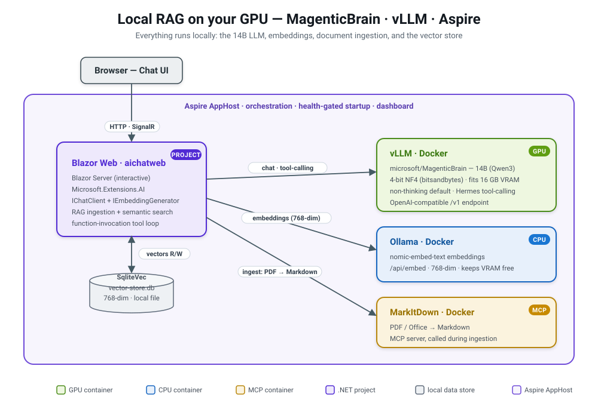

# magenticbrain-vllm-aspire

Run [`microsoft/MagenticBrain`](https://huggingface.co/microsoft/MagenticBrain) — a 14B,
Qwen3-14B-based **tool-orchestration** model — **locally on a single 16 GB GPU** with
**vLLM (Docker)**, orchestrated by **Aspire**, behind the **.NET AI Chat Web App**
(`aichatweb`) template configured for **full RAG** (retrieval-augmented generation with
citations).

Everything runs on your machine: the LLM, the embedding model, document ingestion, and the
vector store. No cloud endpoints, no API keys.

> Staging experiment — unproven by default. See `~/dev/experiments/README.md`.

## Architecture

<p align="center">
  
</p>

<details>
<summary>Text version of the architecture</summary>

```
Aspire AppHost  (orchestrates everything, dashboard for logs/health/traces)
│
├── vllm            custom image: vllm/vllm-openai + bitsandbytes + non-thinking template
│                   GPU (--gpus all --ipc host), serves MagenticBrain 4-bit (NF4)
│                   OpenAI-compatible /v1  →  IChatClient (tool-calling, non-thinking)
│
├── ollama          CPU, model nomic-embed-text (768-dim)
│                   →  IEmbeddingGenerator   (keeps all 16 GB of VRAM for the 14B model)
│
├── markitdown      mcp/markitdown container, converts PDFs/Office docs → Markdown at ingest
│
└── aichatweb-app   Blazor Server chat UI (Microsoft.Extensions.AI)
                    chat       → vLLM      (model id "microsoft/MagenticBrain")
                    embeddings → Ollama    (nomic-embed-text)
                    vector DB  → SqliteVec (local file vector-store.db, 768-dim)
                    ingestion  → MarkItDown MCP + wwwroot/Data
```

</details>

Why two model servers? MagenticBrain is a chat/orchestration model, not an embedding model,
and vLLM serves one model per process. Embeddings therefore run separately on Ollama (CPU) so
they don't compete with the 14B model for VRAM.

## Prerequisites

- **NVIDIA GPU with ~16 GB VRAM** (developed on an RTX 3080 Laptop, 16 GB).
- **Docker** with the **NVIDIA Container Toolkit** (an `nvidia` Docker runtime). On WSL2 this
  works through the Windows NVIDIA driver.
  - Smoke test: `docker run --rm --gpus all nvidia/cuda:12.4.0-base-ubuntu22.04 nvidia-smi`
- **.NET 10 SDK** (projects target `net10.0`).
- **Aspire CLI ≥ 13.4** (optional — `scripts/run.sh` uses `dotnet run` and does not need
  the CLI). Install/update: `curl -sSL https://aspire.dev/install.sh | bash`.
- **~30 GB free disk**: the FP16 weights (~28 GB) download once to the Hugging Face cache, plus
  the ~10 GB vLLM base image and the ~9 GB pre-quantized checkpoint.
- MagenticBrain is public (MIT) and **not gated**; `HF_TOKEN` is optional (avoids rate limits).

## Setup

From the repository root:

### 1. Build the custom vLLM image

```bash
./scripts/build-image.sh          # tags magenticbrain-vllm:local
```

Layers `bitsandbytes` and a non-thinking chat template onto `vllm/vllm-openai`. First run pulls
the ~10 GB base image.

### 2. Pre-quantize the model (strongly recommended, one-time)

```bash
./scripts/prequantize.sh          # writes models/MagenticBrain-bnb-nf4/ (~9 GB, gitignored)
```

vLLM's *in-flight* bitsandbytes quantization is CPU-bound and takes **~28 minutes on every
start**. This script quantizes once **on the GPU (~40 s)** and saves a ready-made NF4
checkpoint; vLLM then loads it in **~10 s**. The first run downloads the ~28 GB FP16 weights to
`~/.cache/huggingface`. The AppHost auto-detects the checkpoint and uses it; without it, it
falls back to (slow) in-flight quantization.

> Free the GPU before running this (stop any running vLLM container) — quantization needs the
> full 16 GB.

### 3. Run the stack

```bash
./scripts/run.sh                  # dotnet run on the AppHost (http profile)
# or, with Aspire CLI >= 13.4:  ASPIRE_ALLOW_UNSECURED_TRANSPORT=true aspire run
```

Watch the console (or the Aspire dashboard) for URLs. When the `vllm` resource reports healthy
(model loaded), open the **aichatweb-app** URL and ask a question about the sample documents in
`MagenticBrainRag.Web/wwwroot/Data`, e.g.:

> *What percentage of waterborne bacteria does the emergency kit's water purification filter remove?*

The model calls its `LoadDocuments` tool (first turn ingests the PDF via MarkItDown → embeds
chunks with Ollama → writes to SqliteVec), then `Search`, then answers **grounded in the
retrieved text with a citation**. If the documents don't contain the answer, it says so instead
of hallucinating.

## How it works (key decisions)

<p align="center">
  
</p>

The answer is produced by a two-tool loop the model drives itself — `LoadDocuments` (lazy,
first-run ingestion) then `Search` (retrieval) — before it composes a grounded, cited reply.

- **4-bit to fit 16 GB.** A 14B model is ~28 GB in FP16. Served at bitsandbytes NF4 the weights
  are ~8–9 GB; with `--max-model-len 16384 --gpu-memory-utilization 0.90 --max-num-seqs 16` the
  whole thing (weights + KV cache) fits in ~14.5 GB.
- **Non-thinking by default.** MagenticBrain (a Qwen3 hybrid) emits `<think>…</think>` blocks by
  default; its model card calls for non-thinking inference. A patched chat template flips the
  default so standard OpenAI-compatible clients need no special per-request fields.
- **Model-card sampling** (temp 0.7, top_p 0.8, presence_penalty 1.0, no greedy decoding) is
  applied as client defaults in `MagenticBrainRag.Web/Program.cs`.
- **Tool-calling** uses vLLM's `--enable-auto-tool-choice --tool-call-parser hermes`, which the
  RAG loop (`LoadDocuments`, `Search`) depends on.

See [`docs/design-notes.md`](docs/design-notes.md) for the full rationale, VRAM tuning, and
gotchas (WSL2, dev certs, Ollama, lazy ingestion).

## Troubleshooting

- **`RuntimeError: UVA is not available` on WSL2.** WSL2 disables CUDA pinned memory; the AppHost
  sets `VLLM_WSL2_ENABLE_PIN_MEMORY=1` on the container to fix it.
- **Model load looks stuck for ~28 min.** You're on the in-flight quantization path — run
  `./scripts/prequantize.sh` once for ~10 s loads thereafter.
- **HTTPS / dev-cert errors, or the dashboard won't bind on WSL2.** Use `./scripts/run.sh` (http
  profile + `ASPIRE_ALLOW_UNSECURED_TRANSPORT=true`).
- **`aspire run` fails with a JSON-RPC/backchannel error.** Your Aspire CLI is older than the
  13.4 runtime. Update it, or just use `./scripts/run.sh`.
- **Embeddings look wrong / dimension mismatch.** Embeddings must be 768-dim
  (`IngestedChunk.VectorDimensions = 768`) to match `nomic-embed-text`. A separate host Ollama on
  `:11434` (without the model) can confuse manual testing — the app uses the Aspire-managed
  container via its injected connection string.

## Repository layout

```
docker/vllm-magenticbrain/   Dockerfile + non-thinking chat template (magenticbrain-vllm:local)
scripts/                     build-image.sh, prequantize.sh/.py, run.sh
models/                      pre-quantized NF4 checkpoint (gitignored, created by prequantize)
MagenticBrainRag.AppHost/    Aspire orchestration (AppHost.cs)
MagenticBrainRag.Web/        Blazor chat UI, RAG ingestion/search, client wiring (Program.cs)
MagenticBrainRag.ServiceDefaults/   shared Aspire service defaults
docs/                        design-notes.md, aichatweb-template.md
```

## License

MIT — see [`LICENSE`](LICENSE).
